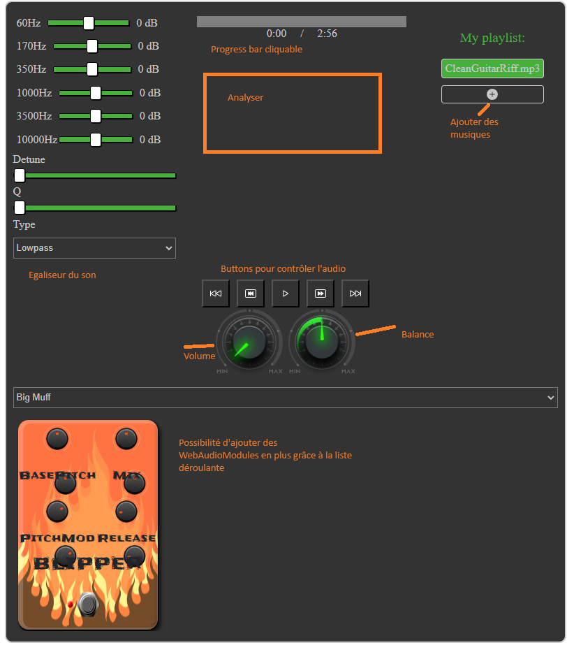

# WebComponents
## Présentation 
Ceci est un petit projet sur le thème des Web components natif. 

Ce projet a été réalisé dans le cadre de l'UE Technologies du Web en Master 2 Miage INTENSE animé par Mr BUFFA Michel.

L'objectif du projet était donc de réaliser plusieurs web components à l'intérieur d'un seul même composant afin de l'utiliser où bon nous semble. 

Le thème du cours était de personalisé la balise HTML "audio", en utilisant la bibliothèque AudioContext ([documentation](https://developer.mozilla.org/fr/docs/Web/API/AudioContext)), du HTML, du CSS et du JS.

## Références 
Pour mener à bien ce projet, je me suis basé sur les cours de Mr BUFFA Michel ([ici](https://www.edx.org/learn/html5/the-world-wide-web-consortium-w3c-html5-apps-and-games)), ainsi que web components déjà pré fait ([webaudio controls](https://github.com/g200kg/webaudio-controls)) et des [WebAudioModules](https://www.webaudiomodules.com/community/plugins.json)

## Documentation 
Pour utiliser le web component vous pouvez aussi bien télécharger ce projet et l'exécuter ou prendre uniquement le dossier "components" et l'inclure le fichier "myAudioPlayer.js" dans votre page web, ex: `` et faire appel à la balise : `<my-audio-player id="myPlayer" src="./assets/audio/CleanGuitarRiff.mp3,./assets/audio/Eminem - Godzilla ft. Juice WRLD.mp3,./assets/audio/Imagine_Dragons_Bones.mp3,./assets/audio/Måneskin_BABY SAID.mp3"></my-audio-player>` par exemple. Entre chaque fichier audio, il faut qu'il y est une virgule. 

Vous avez la possibilité d'ajouter vos musiques à votre guise grâce au bouton "+" au niveau de la playlist 

### Option(s) du composant:
- id: permet de pouvoir le récupérer dans un fichier JS/TS
- src: contient le lien vers votre fichier (pas obligatoire)

Via ce web component, vous aurez la possibilié d'ajouter d'autres musiques à votre playlist, ces musiques seront stockées dans le IndexedDb de votre navigateur. 

### Effet visuel
Pour apporter un effet visuel, le projet se base sur [Butterchurn](https://github.com/jberg/butterchurn?). Dès que la musique commence à être joué, un effet aléatoire apparait et change régulièrement.

### Liste des Web components 
* myAudioPlayer (Composant princpal)
  * myAnalyser
  * myAudioEffect
  * myButterChurn
  * myEqualizer
  * MyPlaylist

## Explications 

